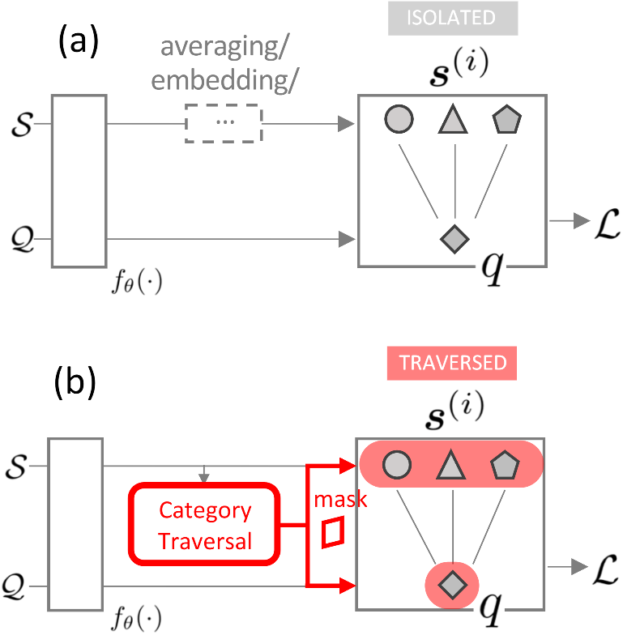
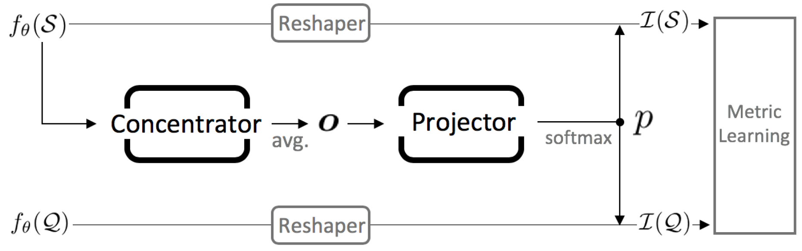

## Category Traversal Module for Few-shot Learning

A PyTorch implementation of our paper 
"Finding Task-Relevant Features for Few-Shot Learning by Category Traversal",
published at CVPR 2019, an **ORAL** presentation.

By [Hongyang Li](http://www.ee.cuhk.edu.hk/~yangli/), [David Eigen](https://cs.nyu.edu/~deigen/),
Samuel Dodge, 
Matthew Zeiler, and Xiaogang Wang.

[[arXiv Paper]](http://arxiv.org/abs/1905.11116) 
[[Poster]](https://drive.google.com/file/d/19d6VIiKYYj3VQxHlu86nq8BHf3rA3Z4U/view?usp=sharing)

[[End-of-internship Presentation Slides]](https://docs.google.com/presentation/d/1T73dgdzaD_jy2M9rNa9E1We44ZaLL9KnDNGuLBxHVfY/edit?usp=sharing) (40 mins)

[[Short Slides]](https://docs.google.com/presentation/d/1Or629oe7FZJHzrnNnWh7lnyIsRtuZW8BwIn8qFFxSWQ/edit?usp=sharing)
(5 mins at CVPR)

(a) describes the conventional metric-based methods and (b) depicts the proposed CTM where features are traversed across
categories for acquiring better representations.




The following figure shows a detailed configuration of our proposed CTM module.



### Overview

- PyTorch `0.4` or above, tested in Linux/cluster/multi/single-gpu(s). 
- Datasets: `tieredImagenet` and `miniImagenet`
- A metric-based few-shot learning algorithm
- The proposed Category Traversal Module (CTM) serves as a plug-and-play
unit to most existing methods, with ~2% improvement in accuracy.

### Install
There are some dependencies; be sure to install the newer version to be 
compatible with the latest pytorch. For example: 
```bash
conda install -c anaconda pillow
```

### How to run

```bash
python main.py --yaml_file configs/demo/tier/5way_1shot_1.yaml
```

### Datasets and performance

We conduct all the experiments on `tieredImagenet` and `miniImagenet` benchmarks; to download
them, please refer to [`DATASET.md`](DATASET.md).

### Adapting CTM module to your own task

### Citation
Please cite in the following manner if you find it useful in your research:
```
@inproceedings{li2019ctm,
  title = {{Finding Task-Relevant Features for Few-Shot Learning by Category Traversal}},
  author = {Hongyang Li and David Eigen and Samuel Dodge and Matthew Zeiler and Xiaogang Wang},
  booktitle = {CVPR},
  year = {2019}
}
```
